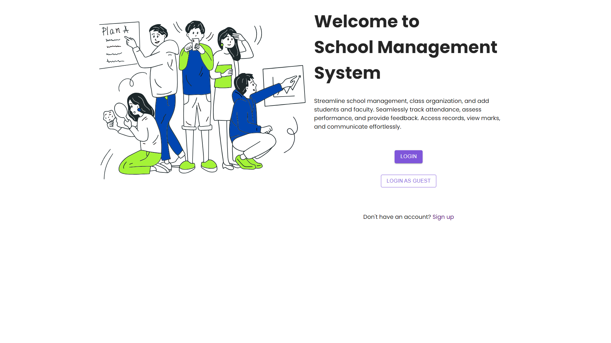

# School Management System

## Overview

The School Management System is a comprehensive application built with the MERN stack (MongoDB, Express.js, React.js, Node.js). It provides distinct panels for admins, teachers, and students, allowing each user type to access and manage their respective functionalities:

- **Admins**: Manage users, classes, attendance, marks, and results.
- **Teachers**: Handle class management, attendance, and grades.
- **Students**: View schedules, attendance, and results.


## Features

- **Admin Panel**:
  - User management (create, update, delete users)
  - Class management (create, update, delete classes)
  - Attendance tracking
  - Marks entry and results management

- **Teacher Panel**:
  - Manage classes
  - Track attendance
  - Enter and update grades

- **Student Panel**:
  - View class schedules
  - Track attendance
  - Check results

 **Clone the repository**:
   ```bash
   git clone <https://github.com/sujoyghoshal/School-Management-System.git> 


